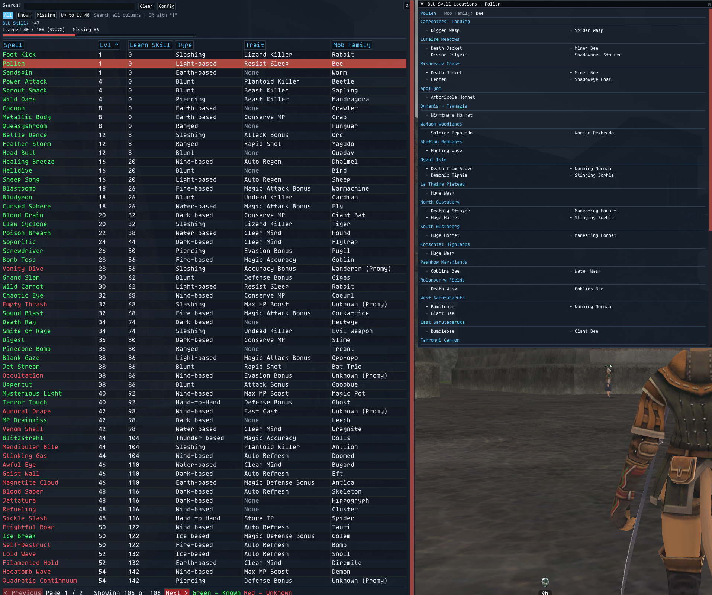
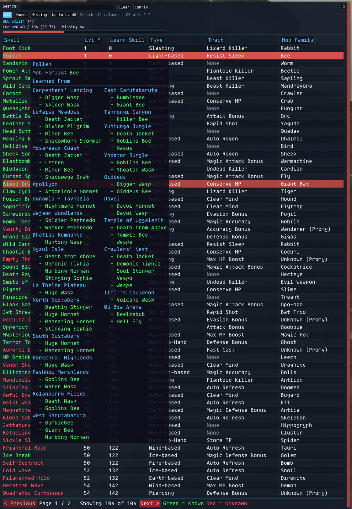
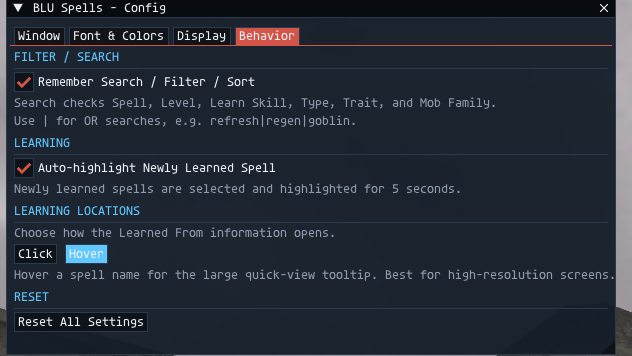

# BLUSpells

**Version:** 1.9.22  
**Platform:** Ashita v4 / HorizonXI  
**Author:** Izumi (ShiroIzumi)

BLUSpells is a Blue Mage spell-learning tracker built around the HorizonXI spell set. It compares the spell database against the current character's learned spells and displays the results in a searchable, sortable, filterable UI.

## Required files

BLUSpells requires:

```text
bluspells.lua
spells.lua
locations.lua
```

`spells.lua` contains the spell metadata used by the UI.

`locations.lua` contains the Horizon-era learning-location reference used by both Click and Hover location views.

## Features

- Learned spells shown in a configurable Known color.
- Missing spells shown in a configurable Unknown color.
- Learned count.
- Missing count.
- Completion percentage.
- Completion progress bar.
- Search across:
  - Spell name
  - Level
  - Type
  - Trait
  - Mob Family
- OR searching with `|`.
- Filters:
  - All
  - Known
  - Missing
  - Ready
- Clickable sortable headers.
- Ascending/descending sorting.
- Sort by:
  - Spell
  - Level
  - Type
  - Trait
  - Mob Family
- Selectable/highlightable rows.
- Newly learned spell detection.
- Optional auto-highlight of newly learned spells.
- Automatic page jump to a newly learned spell.
- Auto or fixed rows per page.
- Configurable row spacing.
- Configurable visible columns.
- Resizable table columns where supported by the Ashita ImGui build.
- Optional persistence of search/filter/sort.
- Persistent main and config window geometry.
- Configurable font scale.
- Configurable background color and opacity.
- Configurable Known, Unknown, Header, and paging colors.
- Lockable window.
- Optional title bar and border.
- Horizon-era **Learned From** reference for all 106 tracked spells.
- **Click mode** (default): click a spell name to open a dedicated **BLU Spell Locations** window.
- Click the currently open spell again to close the location window.
- Click a different spell to reuse the same location window for the newly selected spell.
- Shared location-window position and size are retained while switching between spells.
- Each zone in the Click view divides its monster list evenly into two columns.
- Optional **Hover mode** for high-resolution displays.
- Hover mode uses a large quick-view tooltip and flows long location lists into additional columns at approximately 50 rows per column.
- Learning-location data is filtered to HorizonXI's supported era: original Final Fantasy XI, Rise of the Zilart, Chains of Promathia, and Treasures of Aht Urhgan.

## Commands

| Command | Description |
|---|---|
| `/bluspells` | Toggle the main BLUSpells window. |
| `/bsp` | Short alias for `/bluspells`. |
| `/bsl` | Additional short alias for the main BLUSpells window. |
| `/bsz` | Toggle Zone Info directly. |
| `/bluspellszone` | Toggle Zone Info directly. |
| `/bluspells config` | Toggle the config window. |
| `/bsp config` | Short alias for the config window. |

## Filters

### All

Shows all spells in the database.

### Known

Shows only spells the current character has learned.

### Missing

Shows only spells the current character has not learned.

### Ready

Shows unknown spells whose listed level is less than or equal to the current BLU main-job level.

The Ready filter is only enabled when Ashita can safely determine that the current main job is Blue Mage and can read the current BLU level.

Ready does **not** guarantee that:

- the required monster is currently accessible,
- the spell is available in the current content progression,
- every server-specific prerequisite is met.

It is a level-readiness filter only.

## Search

Search is case-insensitive and checks all spell metadata fields.

Examples:

```text
refresh
goblin
magic attack bonus
piercing
```

Use `|` for OR searches:

```text
refresh|regen
goblin|orc
piercing|slashing
```

## Sorting

Click a column header to sort by that column.

Click the active header again to reverse the sort order.

The current sort direction is shown with an indicator.

## Newly learned spells

While the addon is open, BLUSpells keeps a snapshot of learned spell state.

When a previously unknown spell becomes learned and **Auto-highlight Newly Learned Spell** is enabled, BLUSpells:

1. Selects the spell.
2. Highlights it briefly.
3. Jumps to the page containing it.

## Configuration

### Window tab

- Lock Window Position / Size
- Show Title Bar
- Show Border
- Window Color
- Background Opacity
- Reset Window Position / Size

### Font & Colors tab

- Font Scale
- Known Spells color
- Unknown Spells color
- Header / Accent color
- Paging Buttons color
- Reset Appearance

### Display tab

- Compact / Normal row spacing
- Auto / Fixed rows per page
- Fixed row count
- Show/hide Level
- Show/hide Type
- Show/hide Trait
- Show/hide Mob Family

The Spell column is always visible.

### Behavior tab

- Remember Search / Filter / Sort
- Auto-highlight Newly Learned Spell
- **Learning Locations: Click / Hover**
  - **Click** is the default and opens the dedicated location window.
  - **Hover** shows the large quick-view tooltip and is intended primarily for higher-resolution displays.
- Reset All Settings

## Learned-spell detection

BLUSpells builds a resource cache matching the names in `spells.lua` to Ashita spell resource IDs. Learned state is then checked with Ashita's player spell data.

The Player and ResourceManager objects are checked before use.

## What it cannot do

BLUSpells does not:

- automatically download current HorizonXI data,
- automatically discover monster locations,
- provide zone coordinates or route guidance,
- guarantee a spell is learnable only because your level is high enough,
- automate combat or spell learning,
- target or claim monsters,
- build or equip Blue Magic spell sets,
- manage Blue Magic set points,
- provide MP cost/recast/descriptions unless those fields are explicitly added to the data/UI,
- guarantee that every monster/location entry is permanently accurate if HorizonXI changes its content or spawn data.

## Compatibility

If the local Ashita build does not expose ImGui table functions, BLUSpells contains a fallback renderer. Table-specific functionality such as resizable columns may therefore depend on the Ashita build.

## Learning Locations

BLUSpells includes a learning-location reference for the **106 spells tracked by the HorizonXI ledger**. The reference is stored separately in `locations.lua`.

The data is intentionally restricted to content from the eras currently represented by HorizonXI:

- Original Final Fantasy XI
- Rise of the Zilart
- Chains of Promathia
- Treasures of Aht Urhgan

Later retail content such as **[S] / Wings of the Goddess areas, Abyssea, Adoulin-era zones, Escha, Reisenjima**, and other post-ToAU locations is excluded so the addon does not present misleading learning locations.

### Click mode

**Click** is the default Learning Locations behavior.

Click a spell name to open the dedicated **BLU Spell Locations** window. The window shows:

- Spell name
- Mob Family
- Zone names
- Monsters available in each zone

Each zone's monster list is divided evenly between **two columns**. For example:

- 8 monsters -> 4 / 4
- 15 monsters -> 8 / 7
- 23 monsters -> 12 / 11

Clicking the same spell again closes the location window. Clicking another spell while the window is open switches the existing window to that spell.

The location window uses a shared ImGui window identity, so its position and resized dimensions remain consistent while switching between spells.

### Hover mode

Users with larger/high-resolution displays can select **Hover** under:

```text
Config -> Behavior -> Learning Locations
```

Hovering a spell name then displays the large **Learned From** quick-view tooltip.

For spells with very large source lists, the Hover view flows the list into additional columns at approximately **50 rows per column** instead of producing one extremely tall tooltip.

## Screenshots

### Main BLUSpells Window



### Learning Location Modes

**Hover mode**



**Click mode and Learning Locations configuration**



## Version 1.9.x Changes

### 1.9.0

- Added the dedicated **BLU Spell Locations** window.
- Made **Click** the default Learning Locations behavior.
- Added **Click / Hover** selection under Config -> Behavior.
- Added two-column monster layouts per zone in Click mode.
- Retained the high-resolution Hover quick-view option.

### 1.9.1

- Clicking the currently selected spell again now closes the location window.
- Clicking a different spell switches the open window to the new spell.

### 1.9.2

- Location windows now share one window identity/position rather than remembering a separate position for every spell.

### 1.9.3

- Resized location-window dimensions are now retained when closing, reopening, or switching spells instead of reverting to the default size.

## Location Data Changes Since 1.8.0

- Added `locations.lua` as a BLUSpells-specific learning-location dataset.
- Matched location records only to the 106 spells tracked by BLUSpells.
- Added Horizon-specific spell handling where required.
- Removed later retail-era locations that are not appropriate for HorizonXI.
- Added multi-column handling to the Hover view.
- Increased Hover column length from 30 -> 40 -> **50 rows** based on high-resolution testing.

### Zone Info

The main BLU Spells window now shows a **Zone Info** button beside the learned-spell progress bar, followed by a live **`# of # from this Zone`** count.

Click **Zone Info** to open a window for your current zone showing:

- every tracked Blue Magic spell available in that zone
- the mob or mobs that teach each spell
- spell level
- whether the spell is **Known** or **Missing**

The Zone Info window updates with your current zone and remembers its position and size.

### Zone Info layout update (1.9.5)

- **Zone Info** now appears directly after the main **Missing #** count, above the progress bar.
- The current-zone text now reads **`# of # learned from this Zone`**.
- Zone Info is sorted alphabetically by spell name.
- Each entry now displays **Spell | Lv | Status** on one line, followed by the mobs that teach that spell beneath it.

### 1.9.6

Hotfix for the 1.9.5 Zone Info layout update. A duplicate `end` was left in `draw_zone_info_window`, causing Ashita to fail loading the addon with `<eof> expected near 'end'`. No feature behavior was changed.

### 1.9.7

Adjusted the main summary row so **Learned / Missing**, the **Zone Info** button, and **# of # learned from this Zone** are vertically aligned on the same visual baseline.

### 1.9.8

Fixed the remaining vertical misalignment on the main summary row. Both text sections now use ImGui's frame-padding alignment so **Learned / Missing**, **Zone Info**, and **# of # learned from this Zone** sit on the same baseline.

### 1.9.9

Added a **Hide Known** checkbox beside the **# of # learned** count in the Zone Info window. When enabled, learned spells are hidden and only missing spells for the current zone are shown.

### 1.9.10

Fixed **Lock Window Position / Size** so it now applies to all BLUSpells windows that should obey the lock:

- Main BLUSpells window
- Zone Info window
- Spell Location List window

When locked, Zone Info and Spell Location List can no longer be moved or resized. Unlocking restores normal movement and resizing.

### 1.9.11

The **Window** config tab now has three independent lock options, with the two new checkboxes placed directly under the original one:

- **Lock Window Position / Size** — main BLUSpells window
- **Lock Zone Info Position / Size**
- **Lock Spell Location Position / Size**

### 1.9.12

The shared appearance settings now apply consistently to the main BLUSpells window, Zone Info, and Spell Location List:

- **Show Title Bar**
- **Show Border**
- **Window Color**
- **Background Opacity / Transparency**

When **Show Title Bar** is disabled, Zone Info and Spell Location List each show an **X** close button in the upper-right corner.

### 1.9.13

Fixed scroll-position carryover in the secondary windows.

- **Spell Location List:** switching to a different spell now resets the window to the top instead of preserving the previous spell's scroll position.
- **Zone Info:** changing zones now resets the window to the top instead of preserving the previous zone's scroll position.
- Reopening Zone Info also starts at the top.

Window position and size persistence are unchanged; only the internal vertical scroll position is reset.

### 1.9.14

Added direct Zone Info commands:

```text
/bsz
/bluspellszone
```

Either command toggles the **Zone Info** window directly without opening or closing the main BLUSpells window.

### 1.9.15

- Fixed `/bsz` and `/bluspellszone` so Zone Info can render by itself while the main BLUSpells window is closed.
- Normalized direct command matching for the Zone Info aliases.
- Moved the custom upper-right **X** inward on Zone Info and Spell Location List so a vertical scrollbar can no longer overlap the close button.

### 1.9.16

Moved the main BLUSpells custom **X** inward when the title bar is hidden, matching the scrollbar-safe placement used by Zone Info and Spell Location List.

### 1.9.17

- Added Horizon/Ashita resource-name aliases for Promyvion-era spell names whose resource names differ from the BLUSpells display names.
- **Winds of Promyvion** now correctly matches the abbreviated Horizon resource name **Winds of Promy.** while retaining the full spell name in the UI.
- **Quadratic Continnuum** now correctly matches the abbreviated Horizon resource name **Quad. Continuum** while retaining the BLUSpells display name.
- These aliases are used for learned-spell detection so the affected spells can correctly change from Missing to Known.

### 1.9.18

- Made the **Zone Info** window responsive for smaller displays and narrower window sizes.
- Added a practical minimum width so the window cannot be resized until its contents become unusable.
- At wider widths, the Zone Info header remains a compact single-row layout.
- At narrower widths, header information automatically reflows instead of clipping or overlapping.
- Spell rows dynamically allocate space between spell name, level, and Known/Missing status.
- Existing Zone Info position and size persistence remain intact.

### 1.9.19

- Added `/bsl` as another short command for toggling the main BLUSpells window.
- Existing `/bluspells`, `/bsp`, `/bsz`, and `/bluspellszone` commands remain available.

Updated main-window commands:

```text
/bluspells
/bsp
/bsl
```

Direct Zone Info commands:

```text
/bsz
/bluspellszone
```

### 1.9.20

- Made the dedicated **BLU Spell Locations / Learned From** window responsive in the same manner as Zone Info.
- Added a minimum usable width and responsive maximum width.
- At normal/wide sizes, the spell header displays the spell and mob family side-by-side and monster lists use balanced two-column layouts.
- At narrow sizes, the spell/family information stacks cleanly and monster lists automatically switch to a single column.
- The responsive layout preserves the shared location-window position and size behavior introduced in earlier 1.9.x builds.

### 1.9.21

- Expanded the main-window **BLU Skill** display from the current skill alone to **current / maximum for the current BLU level**.
- Example: `BLU Skill: 160/168`.
- The maximum is calculated from the Horizon-era Blue Magic skill progression for the current Blue Mage level.
- If the current skill can be read but the current BLU level cannot be safely determined, the maximum displays as `--` rather than inventing a value.

### 1.9.22

- Fixed a startup/autoload regression that could prevent BLUSpells from loading when enabled through the **HorizonXI launcher** or loaded from Ashita's `default.txt` startup script.
- The per-character settings callback used shared window constants and the `clamp()` helper before those Lua locals were declared.
- During early startup/settings initialization, those later locals could therefore resolve as nil globals and abort addon initialization.
- Shared Zone Info / Spell Location constants and `clamp()` are now declared before the settings callback is defined and registered.
- Manual loading behavior is unchanged; this fix specifically makes the same addon initialization path safe during early automatic loading.
- No `ImGuiCond_*` values are used for the window-position/size behavior.

## Current Command Reference

| Command | Description |
|---|---|
| `/bluspells` | Toggle the main BLUSpells window. |
| `/bsp` | Short alias for `/bluspells`. |
| `/bsl` | Additional short alias for the main BLUSpells window. |
| `/bluspells config` | Toggle the configuration window. |
| `/bsp config` | Short alias for the configuration window. |
| `/bsz` | Toggle Zone Info directly. |
| `/bluspellszone` | Toggle Zone Info directly. |

## Current 1.9.22 Highlights

- Tracks all 106 HorizonXI-era Blue Magic spells in the BLUSpells dataset.
- Shows learned, missing, and completion information with searchable/sortable spell data.
- Shows **BLU Skill current/max for the current BLU level**.
- Provides current-zone learning information through the responsive **Zone Info** window.
- Provides complete **Learned From / BLU Spell Locations** information in either Click or Hover mode.
- Click mode uses a persistent, resizable secondary window and dynamically changes between one- and two-column mob layouts according to available width.
- Zone Info and Spell Locations are responsive for both large/high-resolution displays and smaller window sizes.
- Handles Horizon-specific abbreviated resource names such as **Winds of Promy.** and **Quad. Continuum** while keeping the full BLUSpells names in the interface.
- Supports independent window locks and shared appearance controls across the main, Zone Info, and Spell Location windows.
- Supports direct Zone Info commands and three aliases for opening the main spell list.
- Per-character settings and window geometry persist across sessions.
- Launcher/default-script autoload is supported by the 1.9.22 startup-scope fix.
